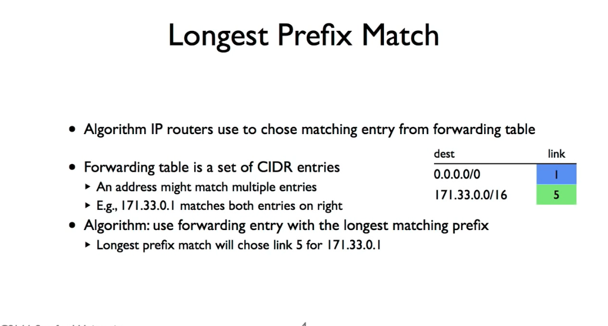
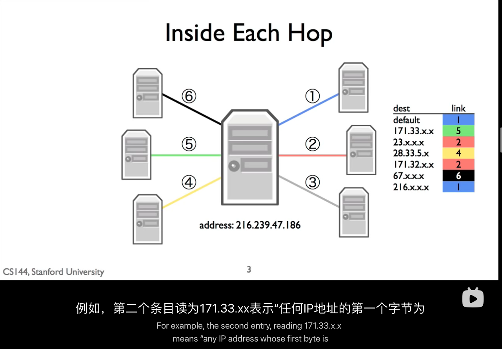
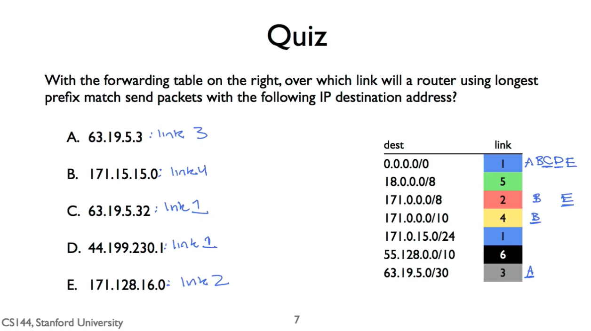

# 1.10_Longest_Prefix_Match

路由器 有 很多 接口，同时处理很多数据包。
但如何 决定 这个数据包 最快到达目的地
这就是靠 Longest_Prefix_Match 算法 解决了

## 路由表

这里 xx 表示 通配符
171.33.x.x 这个表示
171.33.5.245 ～ 171.33.1.1 的请求 全部转发去这个 Link 5

## Entries in this forwarding table have two parts!

进入这个 转发表 有两个部分

- CIDR entry describing a block of addresses,
- and a next hop for packets that match that CIDR entry

## 题目：子网掩码 配对 （全错）

这种题 子网掩码 的题目 每一题都全错，根本做不出来，想不出来 人类如何计算 2 进制 然后配上去，就很烦
