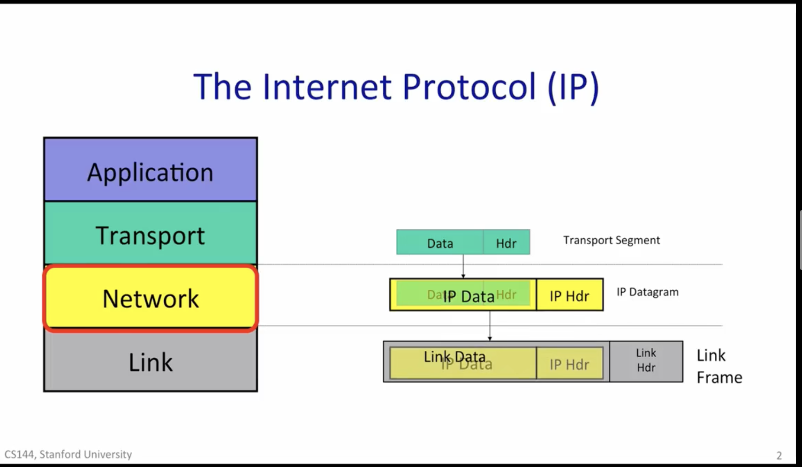
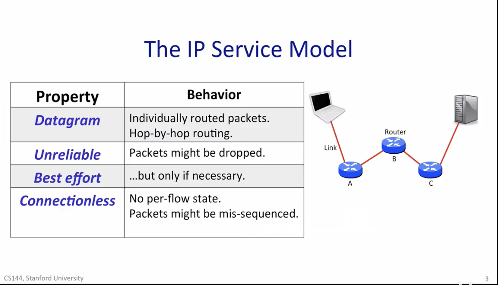
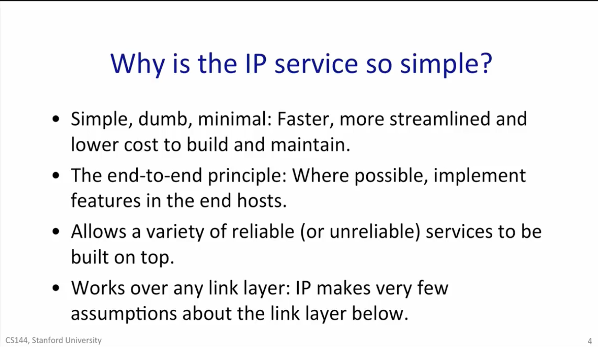
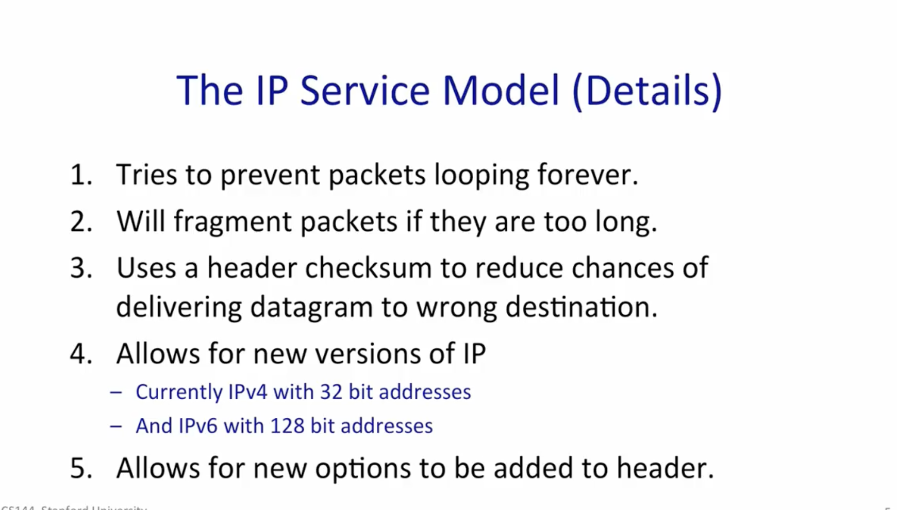
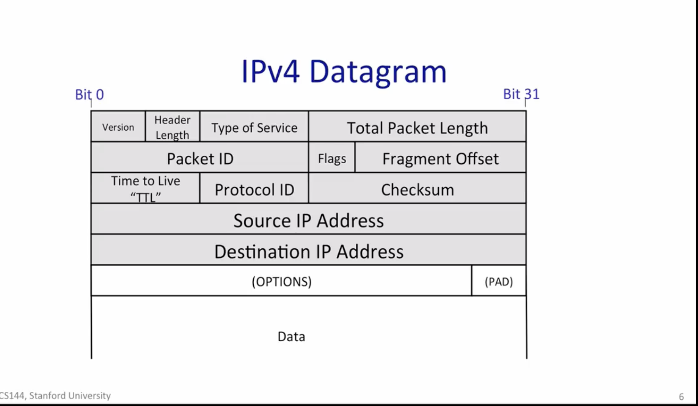
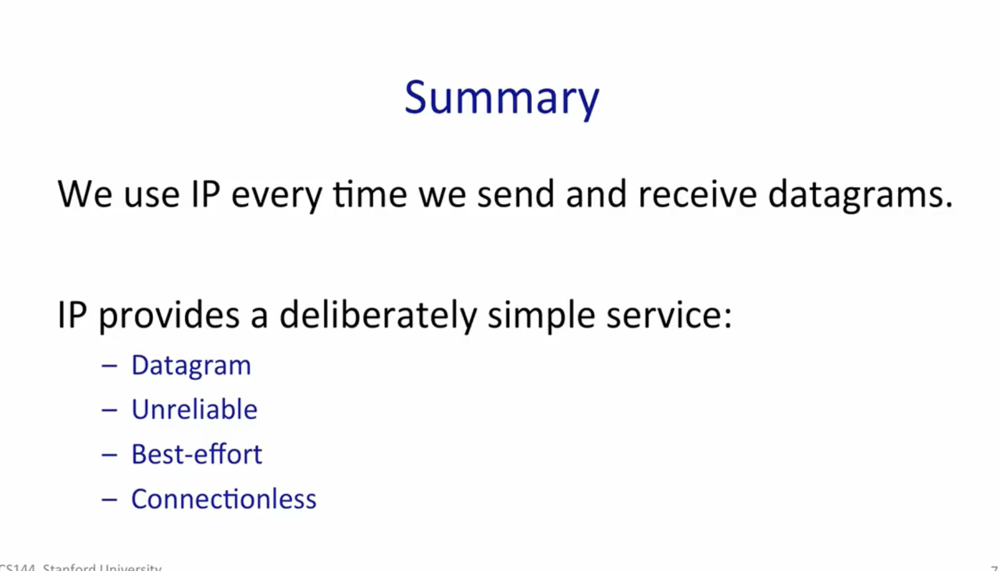

# The_Ip_service_model

每一层 数据包裹

## IP Property :

### 1.Datagram

    所谓的抓包！就是这些Datagram

    ip service Datagram 就是数据流，（数据 + ip 来源 + ip 目的地） 组成一个 数据包

    The router doesn't know the whole path ,it simply uses the destination address to index into tis forwarding table so that it can forward the packet to the next hop along the path towards its final destination.
    期间的Router 路由器，啥都不知道，只知道，收到数据包后，按照 转发表，往 目的地，扔过去

其中 [路由表（Routing Table）、转发表（Forwarding Table）](https://blog.csdn.net/s2603898260/article/details/117201453?ops_request_misc=%257B%2522request%255Fid%2522%253A%2522165511605716781818721761%2522%252C%2522scm%2522%253A%252220140713.130102334..%2522%257D&request_id=165511605716781818721761&biz_id=0&utm_medium=distribute.pc_search_result.none-task-blog-2~all~top_positive~default-1-117201453-null-null.142^v14^pc_search_result_control_group,157^v14^control&utm_term=路由表&spm=1018.2226.3001.4187)的概念

### 2.Unreliable

    不可靠性，数据有可能丢失

### 3.Best effort

    尽力送达，，，除非期间路由 塞满了，被迫 drop 掉

### 4.Connectionless

    就是 源头 到 目的地，没有直接的连接

# Why is the IP service so simple?

- to keep the network,Simple,dumb,minimal:Faster,more streamlined and lower cost to build and maintain.
  保证简单，容易维护

- The end-to-end principle:Where possible,implement features in the end hosts.
  idea is to place as much intelligence as possible at the end points!
  大部分的技术困难，交给 目的地 接收端 解决

- Allows a variety of reliable(or unreliable) services to be built on top.
  就是 app 层 可以建立 可靠 和 不可靠的通信，以保证 低延迟.

- Works over any link layer:Ip makes very few assumptions about the link layer below.
  兼容一切 物理层

## Details

## IPV4 Datagram （这是 Network 层，不要和 Transport 的 TCP，UDP 搞混)

- Source IP Address：来源地
- Destination IP Address : 目的地
- Protocal ID : 是 标明 data 的数据类型，一共 140 种 之多
- Time to Live (TTL): 这个包多久过期，如果到达时间，路由器会把包扔掉，避免 网络柱塞 .
- Version :IPv4 ,IPv6
- Total Packet Length： 就是这个包一共多大，有可能 64Kb.包括 Header + data
- Packet ID,Flags,Fragment Offset ： 有可能包太大，被砍成 几个包，这些就为了 融合他们.

## 总结:

