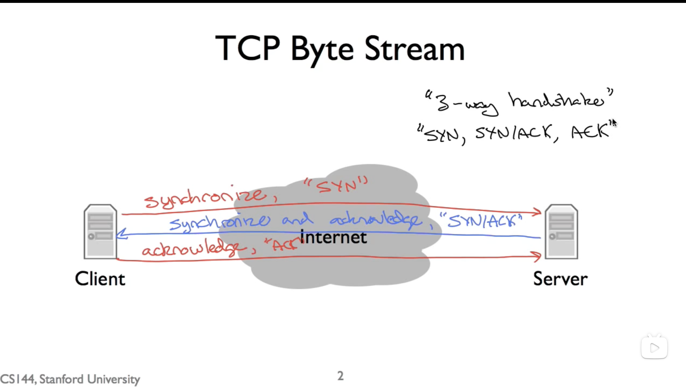
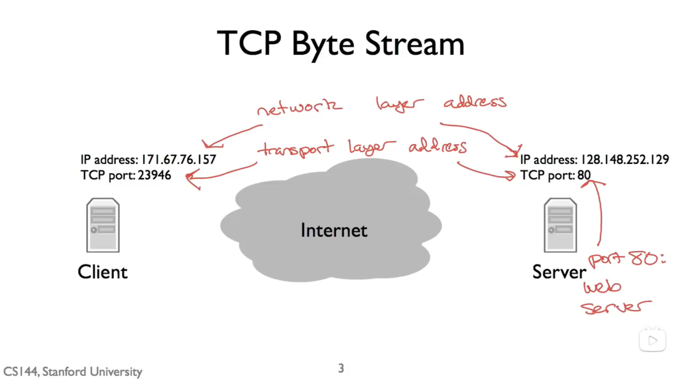
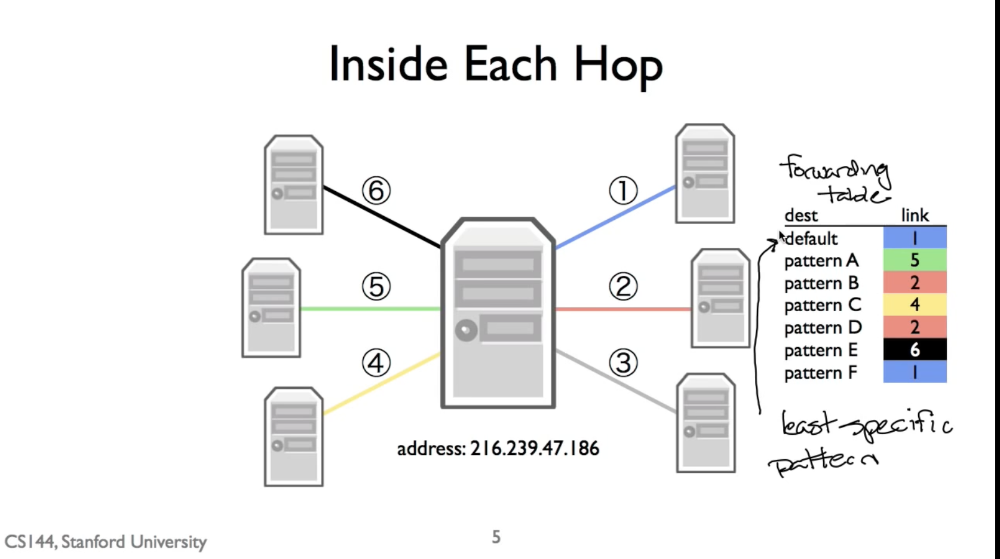

# 1.4_Life_of_Packet

## 三次握手

1.syn
2.syn/ack
3.ack

## open a Tcp stream

    for open a Tcp stream need two addresses!
    1. Internet protocol address,(ip 地址)
    2. tcp port(tap 端口,告诉 对方计算机，这数据是给哪一个程序用的)

## Forwarding Table 转发表

路由器转发，是基于 转发表，路由表的（里面内容，这个包 如何 转发 最有效率）

## traceRoute -w

    TraceRoute -w 命令，让你 查看 从你的电脑 到 目标地址 ，直接要经过的 转发
