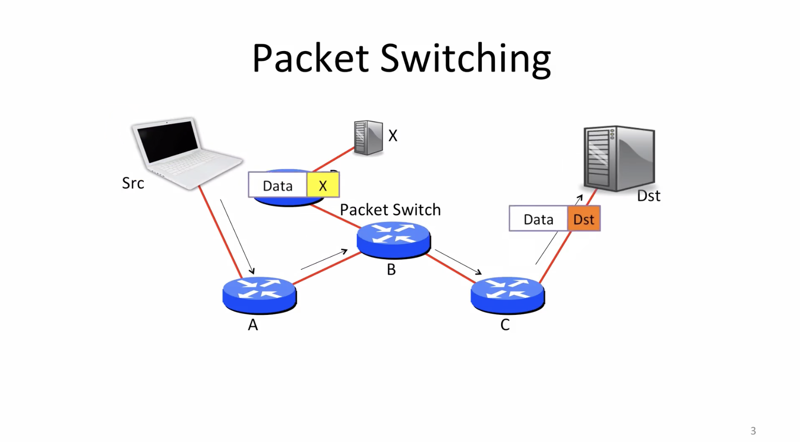
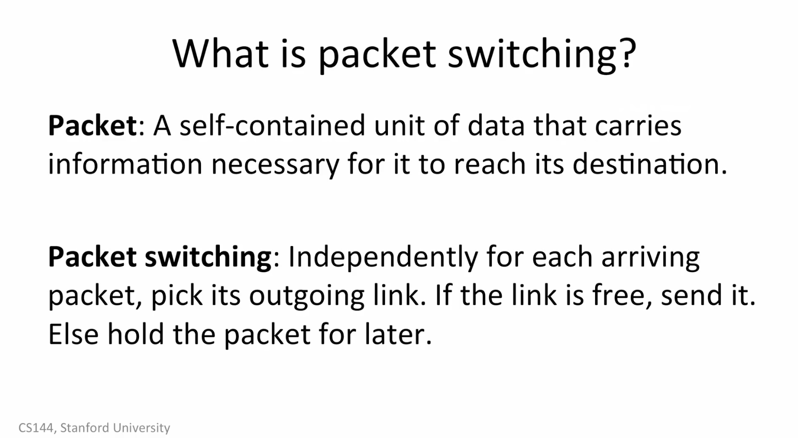
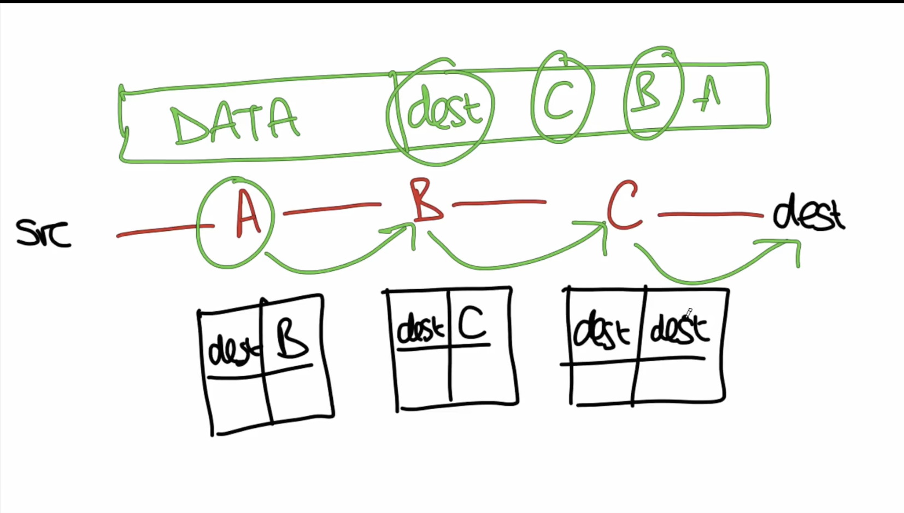
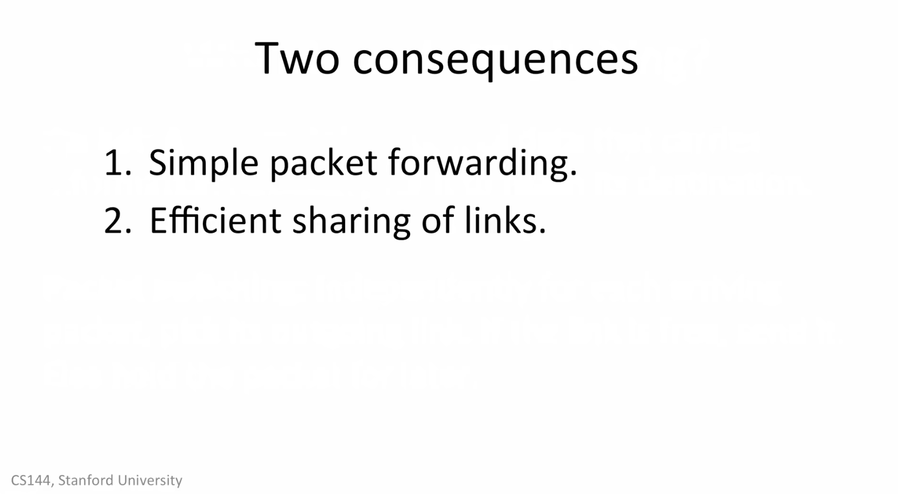
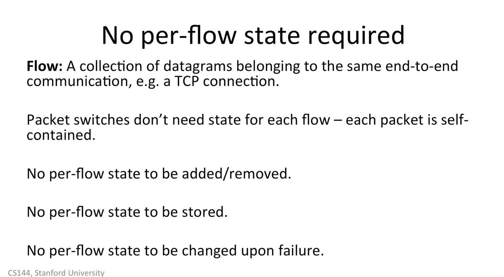
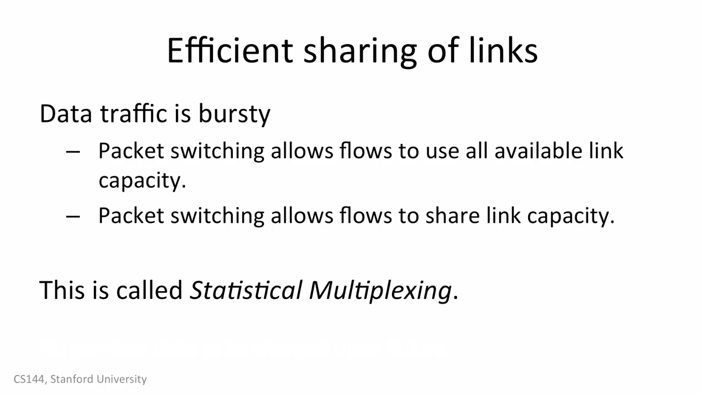
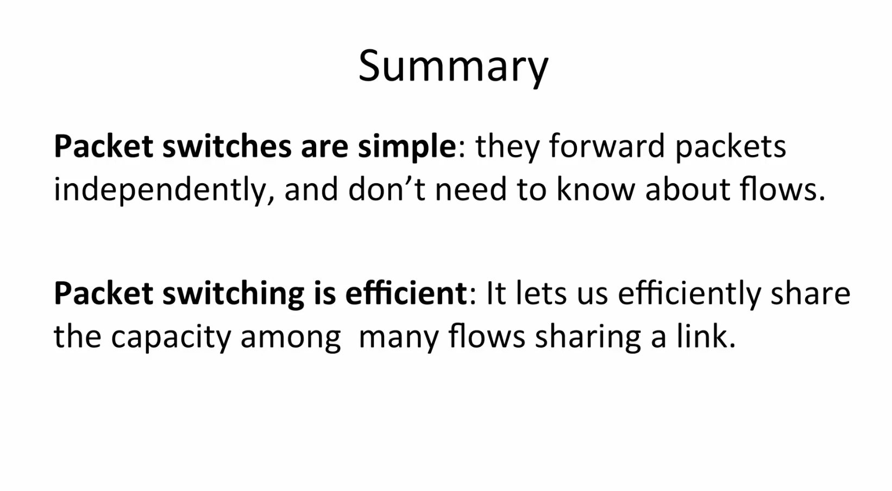

# 1.5_packet_switching_principle

## packet_switching

Packet : A self-contained unit of data that carries information necessary for it to reach its destination.

packet ，就是一个 自己携带 去往 那个地方 信息的 包，我理解为 head，信息头，就是 data 以为的东西。

Packet switching: independently for each arriving packet,pick its outgoing link. if the link is free,send it. else hold the packet for later
Packet switching: 就是 对于 数据包转发来说，每一个数据包都是独立的，如果 link 空闲，那就转发出去。如果 link 繁忙 就拿在手，等一下再发

有两种方法：

- 1。把 每一个 转发路径都写进去 数据包里面，现在为了安全，已经没用了

- 2.下面那种，路由表模式，每次 数据转发，只按 路由 里面的 路由表 进行转发

## two consquences :

1.Simple packet forwarding.
这样简单的传送，不需要把 整个路由表 都放在 传送的数据包里面。

2.Efficient sharing of links.
更高效利用网络， 满足一个 link，给 里面 不同用户 对网络流量 动态 需求。

## No per-flow state required

Flow:就是一堆包，正常网络使用，我们不会发单个数据，基本都是一连串的，比如 网络通话，网络视频 ，这样一连串的数据包 我们叫 Flow

交换机，不会跟踪每一个包 。是否正确到达目的地，因为这样会耗费大量资源，交换机只会 关心 每一个包 的路由表 转发去哪里。

交换机，不会对 数据包 的状态 添油加醋（增加或减少）。

交换机 不会保存 数据包的状态

交换机 不用担心故障

## Efficient sharing of links

data traffic is bursty,数据流量是突发性的，不是总是按固定的速率 发送和接受.

this is called: Statistical Multiplexing

就是按用户需求，动态分配 网络资源。大家共用一条水管.

## Summary

