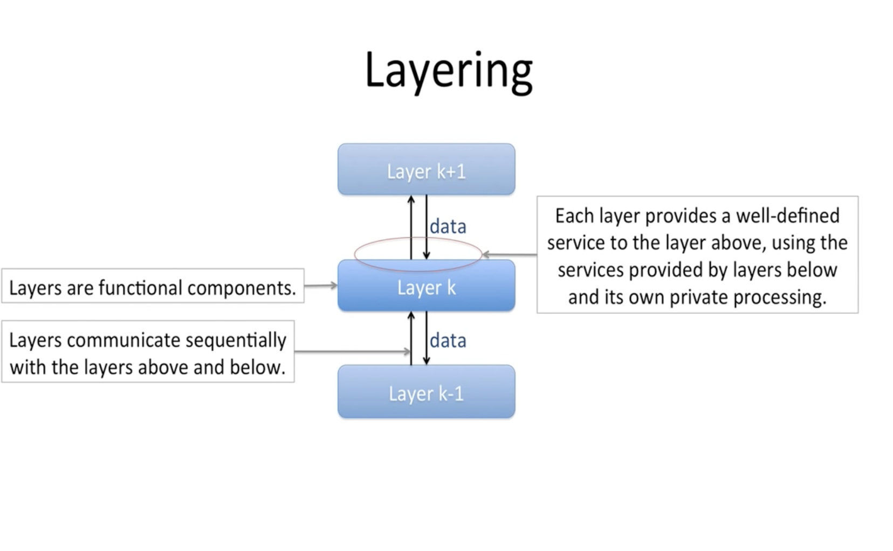
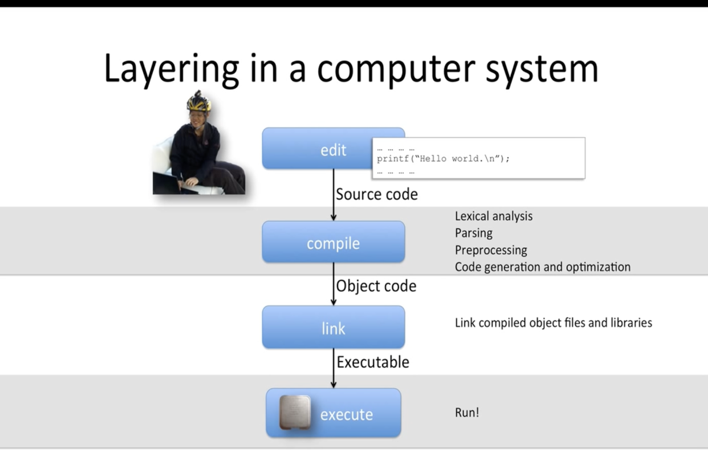
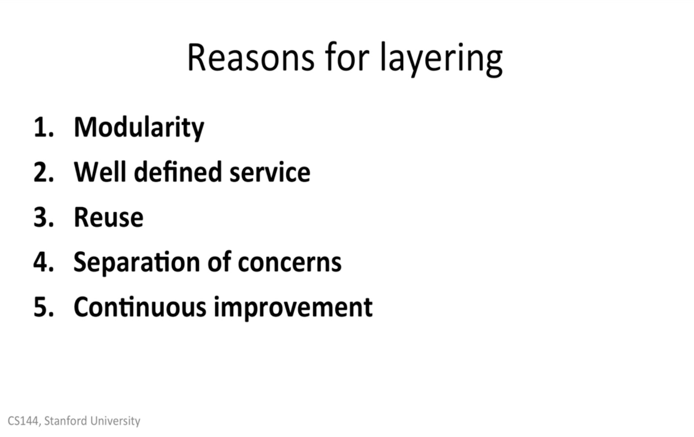

# 1.6_Layering_principle

## Layering

网络分层，这个分层的概念 在其他领域也经常使用，感觉有点像我们软件开发的，高聚集，低耦合。只保留 API 和其他软件交互。以保障系统的稳定性。



## Layering in a computer system



每一个 层，都专注做 自己的事情

## 5 Reasons for layering



```
1.Modularity 模块化，将系统分解为更小，更容易管理的模块
2.Well defined service 定义 明确的 服务，每一层为上一层提供定义明确的服务。
3.Reuse 重复使用，
4.Separation of concerns 关注点分离：每一层都专注自己的工作
5.Continuous improvement 持续性 改进 每一层
6.Peer-to-peer Communications 点对点沟通，每一层只和上一层沟通，足够简单
```
