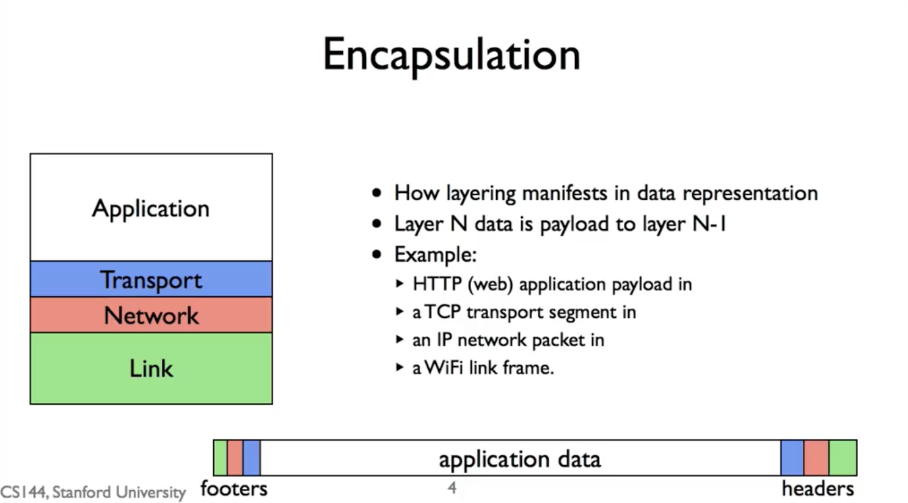
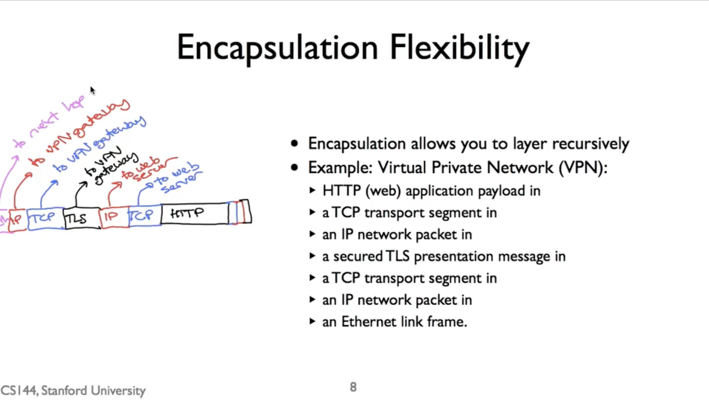

# 1.7_Encapsulation_Principle

封装的架构原理

## Encapsulation 封装:

```
封装就是组合层 和 数据包 交换时 发生的结果
每一个数据包 都包含 来之多个层的数据!
比如：发送一个TCP 数据包 ，包含IP 数据包，里面再包含以太网 数据包
就是 4层 网络传输图 ，里面 那个 数据包 包裹的概念
把上一层的信息 塞进去 下一层，再加个 这一层的头，就叫 封装 ！
```



比如说：你在网页 发送一个 get 请求
你的电脑 发送的数据包就像这样

绿色 ： wifi link
红色 ： IP 数据包
蓝色 ： TCP segment
白色 ： HTTTP GET

这是硬件角度出发

## Encapsulation Flexibility

vpn 原理：
说实在，我看了也不太懂

