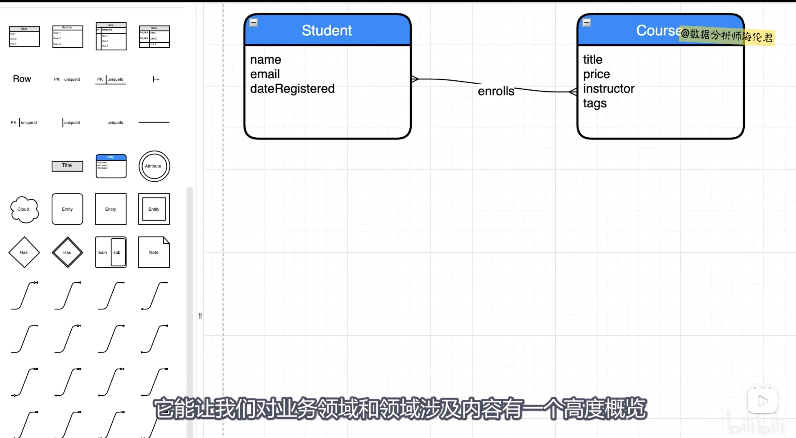
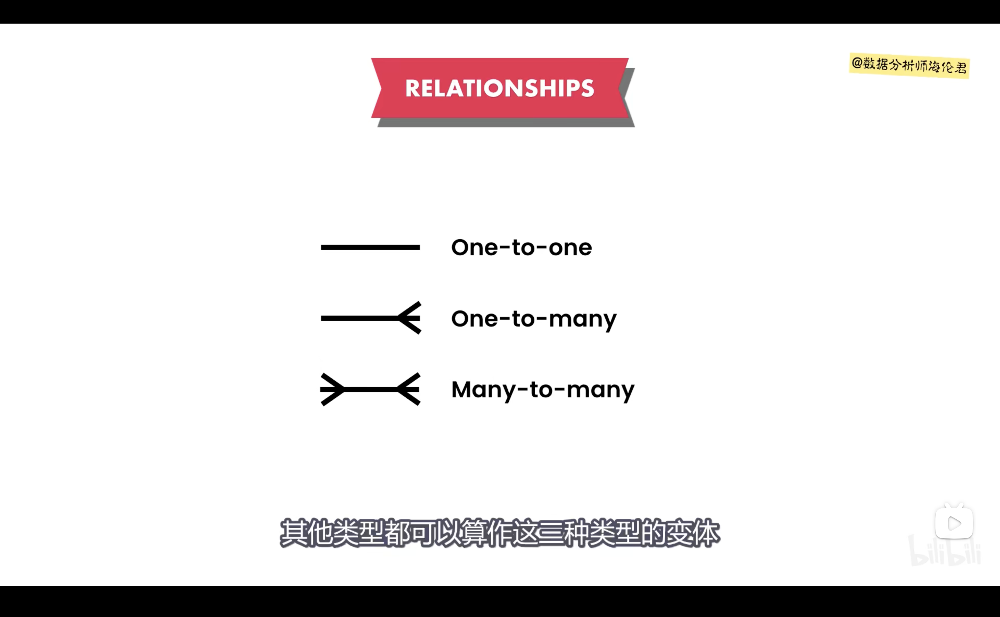
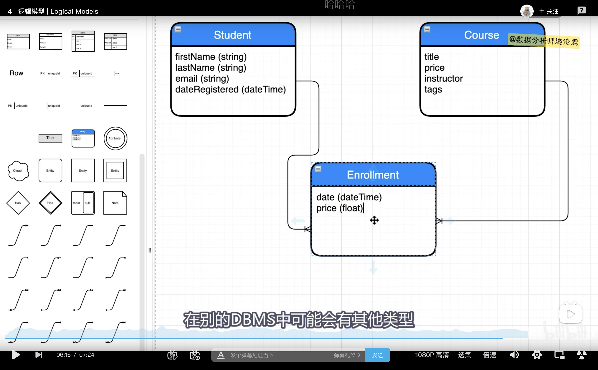
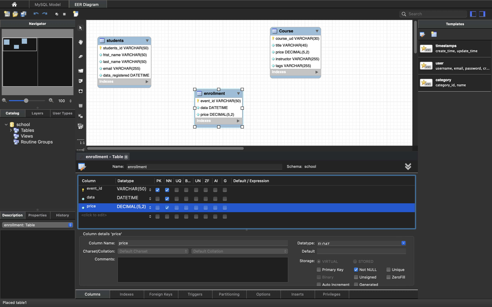

## 2 . Data Modelling

1.Understand the requirements
分析业务需求

```
- 了解业务流程
- 收集业务需求信息
- 上游，信息录入（前端post)
- 下游，用户界面需求(前端 展现)
- 表，文档，app，excel，sql

```

2.Build a Conceptual Model
分析业务需求

```
- 业务实体，事物，概念，以及他们之间的关系
```

3.Build a Logical Model
逻辑模型

```
- 储存数据用于数据结构
```

4.Build a Physical Model

```
- 创建出 表 和 列
- 默认值
- 主键
- not null
- 视图
- 存储过程
- 触发器
```

## 3. Conceptual Models 概念模型

### Data models

#### 模型 3 个概念:

```
1.Conceptual  概念

2.Logical  逻辑

3.Physical  实体
```

这次讲 Conceptual。entity relationship

[画图工具(免费)](https://app.diagrams.net)



## 4. Logical Models 逻辑模型

- 逻辑模型，是脱离与实际模型
- 只是为了展现 与实体的 关系架构
- 一个单表里面，列 尽量分拆（当然要取决业务)，让数据细致
  > 例子： fullName 可以变为 fristName 和 lastName

### 三种类型变体：

- 一对一
- 一对多
- 多对多



### 多对多 关系：

（这图属于概念模型）
只代表了业务实体及其关系


- 每一个学生能报 很多门课
- 每一门课同时 能接纳很多学生

例子：
如果我们想知道，每个学生 enrolls（注册课程) 的具体时间？应该如何实现？
难道要在 学生表 或者 课程表 上加上 注册时间吗？
显然是不对的，因为 表格不能统一，course 里面就 多了几百号学生的注册时间 （列）

```
解决思路：
    应该把 注册时间看作是一个表的属性。但这个属性，既不属于 学生表，也不属于 课程表。
    我们应该另外创建一张表，名为 注册表
```

(这图属于逻辑模型)把实际画出来，重点


## 5. Physical Models 物理模型

写进去 Mysql workBench



## 6. Primary Key 主键

    就是每一个表 必须有一个 独特的，唯一的列 ，作为主键，而且绝对不能 重复
    每一条数据都必须 唯一的

    这内容讲过无数次了，就不记录了

## 7. Foreign Key 外键

- 通过 外键去连接表格，但一定要记住，先有鸡 还是先有蛋的区别，有些当然是同等级

- 比如 shool 这个场景，必须是 先有 学生 再 有 注册表
  所以 学生 是 家长表（这只是一个名称），注册表 是 孩子表（名称而已）

```
就是把其他表 连接到 目标表 内，用其他表的主键 作为 目标表 的外键
这样当 目标表 插入数据 ，就必须符合 其他表格 主键的 一致性
就是说 不能天马行空 ，插入的课程 必须在课程表内， 插入的学生 必须在 学生表内
```


## 8. Foreign Key Constraints 外键约束

- 如果你的表 有 Foreign key ，就必须设置约束，不然 表格容易奔溃


关于 外键 的父表 如果改了主键，这张表应该如何处理
注意：任何的设定都要基于业务需求!!!

on update:
on delete:

- Restrict （限制，拒绝更新）
- Cascade (级联，sql 会自动更新 子表 ) 一般情况选这个！！！
- Set null （改为 null，字面意思）
- No Action (不做改动，默认值)

## 9 .Normalization 标准化

- 标准化是审查我们的设计，并确保他遵循一些防止数据重复的预定义规则的这一过程
- 一共有 7 个 范式，一般来说只用前三个

## 10. First Normal Form(1NF) 第一范式

- Each cell should have a single value and we cannot have repeated columns.
  第一范式：要求 一行中的每一个单元 都应该有单一值，且不能出现 重复列

我的理解：为了表格的可拓展性，不应该把一堆内容 放在一列里面，就是不能往里面塞 json。
必须分拆出来

_0.png>)

案例:

```
比如说 courses 表里面的 tags

- 如果这些 tags 由数据库管理员建立，这情况 最多只有 50 ～ 60 个 tags
- 如果说这些 tags 由用户建立，这情况 可能用几百个

应该 再建立一个表 tags 再和 courses 表 多对多 连接
注意：mysql 是没有多对多链接 的 ，只有一对多 ，多对一

```

## 11.Link Tables 链接表

#### 多对多，一对多 讲解:

```
SQL的一对多,多对一，一对一，多对多什么意思？


1、一对多：比如说一个班级有很多学生，可是这个班级只有一个班主任。在这个班级中随便找一个人，就会知道他们的班主任是谁；知道了这个班主任就会知道有哪几个学生。这里班主任和学生的关系就是一对多。

2、多对一：比如说一个班级有很多学生，可是这个班级只有一个班主任。在这个班级中随便找一个人，就会知道他们的班主任是谁；知道了这个班主任就会知道有哪几个学生。这里学生和班主任的关系就是多对一。

3、一对一：比如说一个班级有很多学生，他们分别有不同的学号。一个学生对应一个学号，一个学号对应一个学生；通过学号能找到学生，通过学生也能得到学号，不会重复。这里学生和学号的关系就是一对一。

4、多对多：比如说一个班级有很多学生，他们有语文课、数学课、英语课等很多课。一门课有很多人上，一个人上很多门课。这里学生和课程的关系就是多对多。


1、一对一的使用方法

（1）使用嵌套结果映射来处理重复的联合结果的子集 。

（2）通过执行另外一个SQL映射语句来返回预期的复杂类型。

2、一对多的实现方法

在多的一方的表里面，添加外键。

3、多对多的实现方法

多对多，必须要通过单独的一张表来表示。
```


上图 讲解：

```
在tags 表的基础上，再创建出 course tags 表
在 新表 course tags 中:
1.有效显示 课程 和 tags 的关系
2.如果要修改 tags，不需要锁定 课程表

隔壁的 注册表（enrollments 同理）
```

## 12.Second Normal Form(2NF) 第二范式

- Every table should describe one entity,and every column in that table should describe that entity.
  第二范式 要求 每一张表 都应该有 一个单一 目的，换句话说，他应该只能代表一种 且仅有一种实体类型。
  而那种表中 的每一列 都应该用来 描述那个实体。

我的理解：

```
就是 每一个表 都是 独特 唯一 的！ 里面的 每一列 都在 描述着 这个表.
像每一幅画，只有一个色调。
```

## 13.Third Normal Form(3NF) 第三范式

- A column in a table should not be derived from other columns.
  就是，表中的一个值，不应该 依赖于 其他值 衍生出来。

- 就是 1 + 2 = 3 ,这样 3 行，应该去掉 3，只保留 1 和 2
